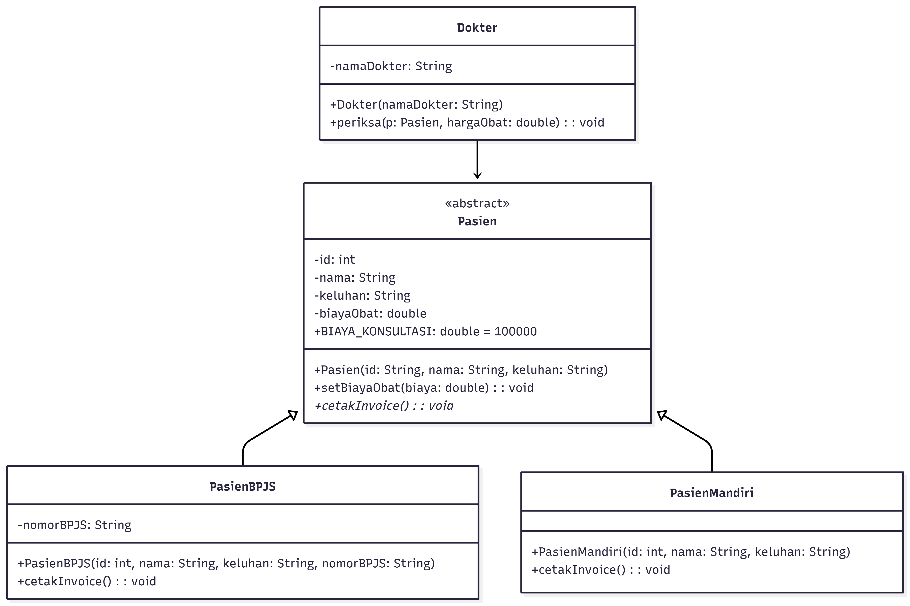
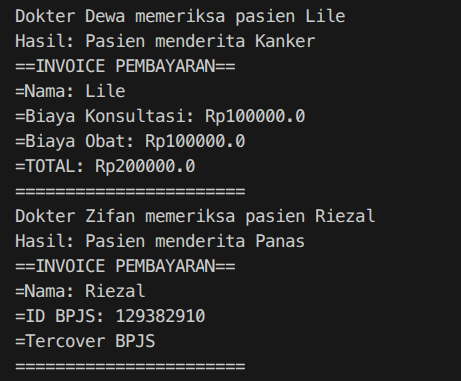

# Laporan Tugas Pemrograman Java: Paradigma OOP

## 1. Deskripsi Kasus
**Sistem Pemeriksaan dan Administrasi Pasien Rumah Sakit**
Kasus yang diangkat adalah proses alur pasien di rumah sakit, mulai dari pemeriksaan medis oleh dokter hingga proses administrasi pembayaran. Masalah ini diselesaikan dengan paradigma OOP untuk membedakan perlakuan antara **Pasien BPJS** dan **Pasien Mandiri**. 

Sistem ini mensimulasikan bagaimana seorang objek `Dokter` berinteraksi dengan objek `Pasien` untuk menentukan biaya obat berdasarkan hasil diagnosa, yang kemudian akan memicu kalkulasi biaya yang berbeda tergantung jenis kepesertaan pasien tersebut.

---

## 2. Class Diagram
Rancangan struktur kelas pada program ini adalah sebagai berikut:



---

## 3. Kode Program Java
```java
public class App {
    public static void main(String[] args) throws Exception {
        Dokter zifan = new Dokter("Zifan");
        Dokter dewa = new Dokter("Dewa");

        Pasien pBaru1 = new Pasien_BPJS(123912, "Riezal", "Panas", 129382910);
        Pasien pBaru2= new Pasien_Mandiri(122232, "Lile", "Kanker");

        dewa.periksa(pBaru2, 100000);
        pBaru2.cetak_invoice_pembayaran();

        zifan.periksa(pBaru1, 50000);
        pBaru1.cetak_invoice_pembayaran();
    }
}

abstract class Pasien {
    protected int id;
    protected String nama;
    protected String keluhan;
    protected double biaya_obat;
    protected double biaya_Konsultasi = 100000;

    public Pasien(int id, String nama, String keluhan) {
        this.id = id;
        this.nama = nama;
        this.keluhan = keluhan;
    }

    public void setBiayaObat(double biaya) {
        this.biaya_obat = biaya;
    }

    public abstract void cetak_invoice_pembayaran();
}

class Pasien_BPJS extends Pasien {
    private int ID_BPJS;

    public Pasien_BPJS(int id, String nama, String keluhan, int ID_BPJS) {
        super(id, nama, keluhan);
        this.ID_BPJS = ID_BPJS;
    }

    @Override
    public void cetak_invoice_pembayaran() {
        System.out.println("==INVOICE PEMBAYARAN==");
        System.out.println("=Nama: " + nama);
        System.out.println("=ID BPJS: " + ID_BPJS);
        System.out.println("=Tercover BPJS");
        System.out.println("=======================");
    }
}

class Pasien_Mandiri extends Pasien {
    public Pasien_Mandiri(int id, String nama, String keluhan) {
        super(id, nama, keluhan);
    }

    @Override
    public void cetak_invoice_pembayaran() {
        double total = biaya_obat + biaya_Konsultasi;
        System.out.println("==INVOICE PEMBAYARAN==");
        System.out.println("=Nama: " + nama);
        System.out.println("=Biaya Konsultasi: Rp" + biaya_Konsultasi);
        System.out.println("=Biaya Obat: Rp" + biaya_obat);
        System.out.println("=TOTAL: Rp" + total);
        System.out.println("=======================");
    }
}

class Dokter {
    private String nama_dokter;

    public Dokter(String nama_dokter) {
        this.nama_dokter = nama_dokter;
    }

    public void periksa(Pasien p, double harga_obat) {
        System.out.println("Dokter " + nama_dokter + " memeriksa pasien " + p.nama);
        System.out.println("Hasil: Pasien menderita " + p.keluhan);
        p.setBiayaObat(harga_obat);
    }
}
```
---

## 4. Output  
   

---

## 5. Penjelasan Prinsip-Prinsip OOP yang Diterapkan

Dalam implementasi program ini, terdapat empat pilar utama OOP yang digunakan:

1. **Inheritance (Pewarisan):** Class `Pasien_BPJS` dan `Pasien_Mandiri` merupakan *subclass* yang mewarisi atribut (`id`, `nama`, `keluhan`) serta method dari *superclass* `Pasien`. Hal ini memungkinkan efisiensi kode karena kita tidak perlu menulis ulang logika yang sama untuk setiap jenis pasien.

2. **Encapsulation (Pengkapsulan):** Data sensitif seperti `ID_BPJS` pada class `Pasien_BPJS` dan `nama_dokter` pada class `Dokter` diatur menggunakan akses modifier `private`. Hal ini memastikan bahwa data tersebut hanya dapat diakses atau diubah melalui mekanisme yang sah (seperti *constructor* atau *setter*), sehingga integritas data terjaga.

3. **Abstraction (Abstraksi):** Penggunaan `abstract class Pasien` bertujuan untuk menciptakan kerangka umum. Kita tidak bisa membuat objek `Pasien` secara langsung (instansiasi), karena pasien di dunia nyata harus memiliki kategori yang jelas (BPJS atau Mandiri). Method `cetak_invoice_pembayaran()` juga dibuat *abstract* untuk memaksa setiap subclass menentukan cara cetak invoice-nya sendiri.

4. **Polymorphism (Polimorfisme):** Terjadi saat method `cetak_invoice_pembayaran()` dipanggil. Meskipun kedua jenis pasien menggunakan nama method yang sama, output yang dihasilkan berbeda. `Pasien_BPJS` akan menampilkan nomor BPJS, sedangkan `Pasien_Mandiri` akan menampilkan rincian biaya konsultasi dan obat.

---

## 6. Penjelasan Keunikan yang Membedakan
Program ini memiliki beberapa nilai unik yang membedakannya dari implementasi standar lainnya:

* **Interaksi Antar-Objek yang Dinamis:** Berbeda dengan program sederhana yang hanya menampilkan data, program ini menonjolkan interaksi nyata antara objek `Dokter` dan `Pasien`. Melalui method `periksa()`, objek Dokter secara aktif mengubah *state* atau kondisi biaya pada objek Pasien. Ini mencerminkan alur kerja rumah sakit yang autentik.
  
* **Pemisahan Logika Bisnis:** Pemisahan antara biaya tetap (`biaya_Konsultasi`) dan biaya variabel (`biaya_obat`) memberikan fleksibilitas. Selain itu, penggunaan tipe data `double` pada perhitungan biaya memastikan akurasi nilai desimal jika nantinya terdapat pajak atau diskon tambahan.

* **Struktur Kode Clean & Scalable:** Kode disusun tanpa komentar yang berlebihan (clean code) namun tetap mudah dipahami melalui penamaan variabel yang deskriptif. Struktur ini sangat mudah dikembangkan jika ke depannya rumah sakit ingin menambah kategori baru, seperti "Pasien Asuransi Swasta" atau "Pasien VIP", tanpa merusak kode yang sudah ada.
